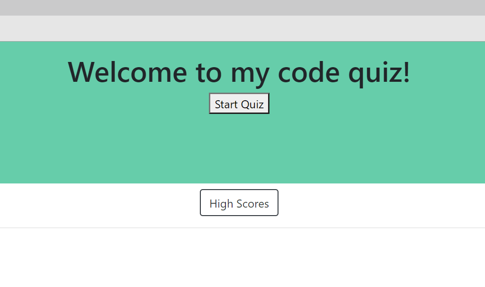
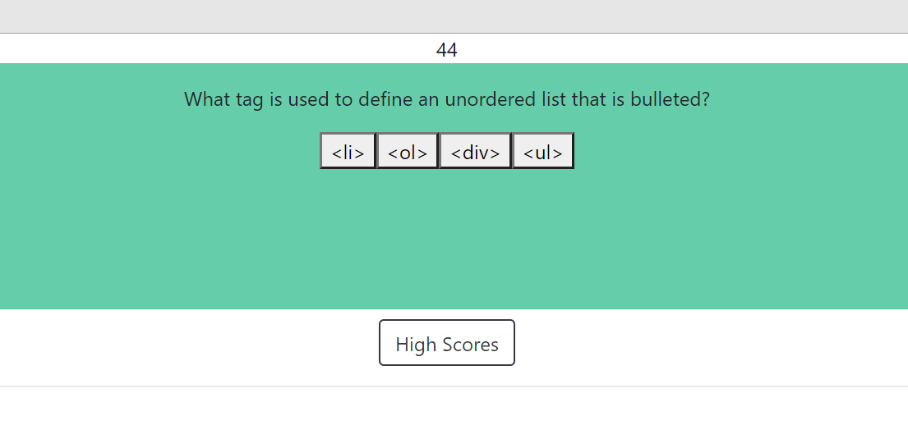

# webAPIs - Code Quiz
This is a project where I will create a site using JavaScript to ask the user questions and if they click the wrong answer, they will lose five seconds on their timer/score. On the home page, it's pretty simple. We show text saying welcome to our quiz, and two buttons. One button starts the quiz, the other button links to the high scores. In the quiz there is a timer that counts down. If you press the wrong answer, we deduct 5 seconds which deducts 5 points from their score. 

Unfortunately, I wasn't able to come to full completion of this project. Once the score hits 0, or you finish the quiz questions, the user is then prompted to insert their name which would save to their local storage.
 
### Here are a few images:

Link to the quiz: <https://wleondike.github.io/webAPIs/>

